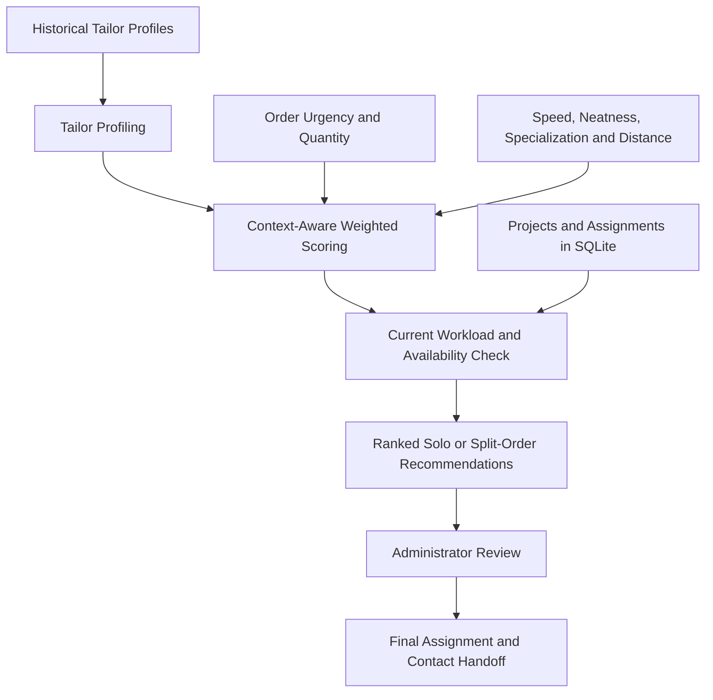
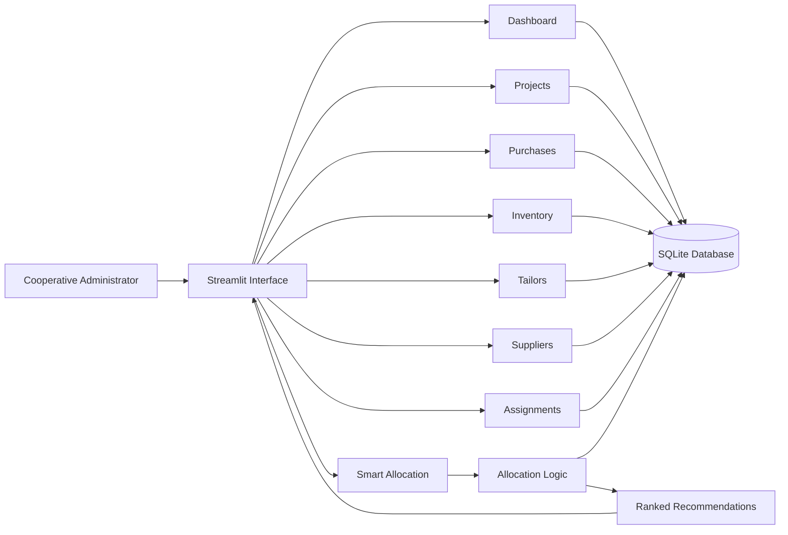

# SAKTI — Intelligent Tailor Allocation & Cooperative Management System

> **2nd Place — PCU × SUTD GEO 2026**  
> Developed in collaboration with **Koperasi Sumber Mulia Barokah**

SAKTI (*Sistem Alokasi Koperasi Terintegrasi & Inteligen*) is a hybrid decision-support and cooperative operations prototype designed to help tailoring cooperatives distribute production orders more fairly, monitor active workloads, and centralize operational data.

The application combines a practical Streamlit management dashboard with context-aware tailor recommendations, inventory tracking, supplier and purchase records, project monitoring, and solo or split-order allocation workflows.

> **Human-in-the-loop by design:** SAKTI generates ranked recommendations. The cooperative administrator reviews and confirms the final assignment.

---

## Quick Links

- **Portfolio case study:** [ezradesmonds.my.id/work/tailor-cooperative-system](https://www.ezradesmonds.my.id/work/tailor-cooperative-system/)
- **Repository:** [github.com/ezradesmonds/koperasi_app](https://github.com/ezradesmonds/koperasi_app)
- **Event:** PCU × Singapore University of Technology and Design — GEO 2026
- **Industry partner:** Koperasi Sumber Mulia Barokah
- **Status:** Operational hackathon prototype

---

## Table of Contents

- [Project Context](#project-context)
- [Problem Statement](#problem-statement)
- [Solution Overview](#solution-overview)
- [Product Discovery and Design Thinking](#product-discovery-and-design-thinking)
- [Allocation Decision Framework](#allocation-decision-framework)
- [Current Implementation Status](#current-implementation-status)
- [Core Features](#core-features)
- [System Architecture](#system-architecture)
- [Database Model](#database-model)
- [Technology Stack](#technology-stack)
- [Project Structure](#project-structure)
- [Getting Started](#getting-started)
- [Typical Workflow](#typical-workflow)
- [Screenshots](#screenshots)
- [Outcome](#outcome)
- [Limitations and Responsible Use](#limitations-and-responsible-use)
- [Roadmap](#roadmap)
- [Team and Contributions](#team-and-contributions)
- [Acknowledgements](#acknowledgements)

---

## Project Context

Tailoring cooperatives may manage large project-based orders across many independent tailor partners. Administrators must consider several factors before assigning work:

- current workload and availability;
- sewing speed and punctuality;
- neatness and specialization;
- order urgency and quantity;
- production capacity;
- distance and logistics;
- available fabric and remaining inventory.

During the hackathon, the team studied a cooperative workflow in which many allocation and inventory decisions depended heavily on memory, manual communication, and fragmented records.

The prototype was designed around **100+ tailor profiles** used during the project-development phase. This number refers to the prototype dataset and should not be interpreted as a production deployment metric.

---

## Problem Statement

The cooperative faced several interconnected operational challenges:

1. **Subjective workload allocation**  
   Administrators had to remember each tailor's capabilities and availability, increasing the risk of inconsistent or biased assignment decisions.

2. **Uneven order distribution**  
   Work could accumulate around a small number of preferred tailors while other capable partners remained idle.

3. **Limited workload visibility**  
   It was difficult to compare active assignments, deadlines, production capacity, and tailor status in one place.

4. **Fragmented inventory records**  
   Leftover and unused materials were not consistently represented in an integrated digital inventory system.

5. **High-pressure bulk orders**  
   Large orders made manual allocation increasingly difficult because urgency, quantity, capacity, quality, and logistics had to be considered simultaneously.

### Design Question

> How might we distribute production workloads more objectively and efficiently based on order urgency, quantity, tailor capabilities, distance, and current availability?

---

## Solution Overview

SAKTI provides an integrated operational dashboard and a recommendation workflow for matching new production orders to suitable tailor capacity.

The platform supports:

- tailor, supplier, project, purchase, inventory, and assignment records;
- project and production-progress monitoring;
- operational and financial dashboard indicators;
- context-aware solo-tailor recommendations;
- split-order recommendations for work that exceeds a single tailor's capacity;
- workload checks based on current assignment data;
- WhatsApp handoff links for contacting recommended tailors;
- administrator review before final assignment.

The product is a **decision-support system**, not a fully autonomous assignment engine.

---

## Product Discovery and Design Thinking

The team used a human-centered product process before building the prototype.

### 1. User Persona

The primary user was modeled as a cooperative operations administrator responsible for:

- receiving incoming orders;
- checking material availability;
- distributing work among tailors;
- tracking deadlines and production progress;
- monitoring leftover inventory;
- coordinating through manual tools and messaging channels.

The most relevant needs were:

- an integrated operational database;
- fair and efficient allocation support;
- real-time inventory visibility;
- faster comparison of tailor capabilities and workload;
- reduced reliance on individual memory.

### 2. Customer Journey Mapping

The workflow was mapped from order intake through project completion:

1. Receive a new order.
2. Re-check remaining fabric.
3. Calculate material requirements.
4. Decide workload distribution.
5. Track tailor progress and deadlines.
6. Perform quality control.
7. Return leftover fabric to inventory.

The most significant friction appeared during inventory verification, workload allocation, and progress monitoring.

### 3. Storyboarding

The storyboard illustrated a future workflow in which the system:

- checks available material records;
- compares tailor capacity and status;
- recommends tailors using order context;
- calculates additional material requirements;
- tracks production completion;
- returns unused material into inventory records.

### 4. Business Model Canvas

The project considered:

- **Primary users:** cooperative administrators and managers;
- **Beneficiaries:** member tailors, particularly capable partners who may be overlooked in manual allocation;
- **End customers:** schools, government institutions, and organizations placing project-based uniform orders;
- **Key partners:** fabric suppliers, tailor communities, educational institutions, and project providers;
- **Key resources:** tailor data, allocation logic, inventory data, and the web-based operational dashboard.

### 5. Value Proposition Canvas

The solution was designed to address:

- workload-distribution errors;
- “ghost inventory” and missing stock visibility;
- excessive dependency on individual memory;
- slow managerial decision-making;
- difficulty monitoring production progress.

Its intended gains include:

- more transparent assignment decisions;
- improved workload visibility;
- integrated operational records;
- faster administrative workflows;
- better use of tailor specialization and capacity.

---

## Allocation Decision Framework

SAKTI was conceived as a three-layer decision-support framework.



### Layer 1 — Tailor Profiling

Tailor profiles may include attributes such as:

- sewing speed;
- neatness;
- punctuality;
- specialization;
- distance;
- estimated production capacity;
- historical performance indicators.

During the hackathon, the team explored grouping tailors with similar characteristics to make a large partner dataset easier to interpret.

Examples of interpretable profile categories may include:

- high-capacity or speed-oriented tailors;
- quality-focused tailors;
- general-purpose tailors;
- partners who may require additional supervision.

### Layer 2 — Context-Aware Weighted Scoring

The recommendation logic adapts to the order context.

Examples:

- urgent work can place greater weight on speed and availability;
- quality-sensitive work can place greater weight on neatness and specialization;
- smaller orders can prioritize nearby tailors;
- larger orders can justify a wider delivery radius when production capacity is more important;
- orders that exceed one tailor's capacity can generate split-order recommendations.

The scoring layer should remain configurable rather than treating one fixed weighting scheme as universally correct.

### Layer 3 — Real-Time Workload Balancing

Before producing the final ranking, SAKTI checks current project and assignment records.

Busy tailors remain visible, but their active workload can reduce their recommendation score. This approach:

- avoids repeatedly assigning work to the same partners;
- prioritizes available capacity;
- preserves administrator visibility;
- supports a fairer distribution process without removing human judgment.

---

## Current Implementation Status

The current repository implements the core operational workflow using:

- deterministic Python allocation rules;
- weighted scoring based on order and tailor attributes;
- SQLite project, assignment, and availability records;
- solo and split-order recommendation logic;
- Streamlit interfaces for administrator review.

### Machine-Learning Scope

The hackathon concept included ML-assisted tailor profiling and data clustering. In the current repository, the core application does **not require a trained ML model** to run.

Scikit-learn should only be presented as part of the production workflow when the repository contains and executes the relevant:

- preprocessing pipeline;
- clustering or profiling code;
- trained artifact or reproducible training script;
- validation output;
- integration between generated profiles and the allocation workflow.

Until that integration is complete, the most accurate description is:

> A hybrid decision-support prototype using context-aware weighted scoring and real-time workload checks, with ML-assisted profiling explored during the hackathon.

This distinction prevents the project from overstating the role of machine learning.

---

## Core Features

### Executive Dashboard

- project and production KPIs;
- operational spending summaries;
- stock-level indicators;
- active tailor and assignment information;
- project-progress visualizations;
- supplier and purchase analytics.

### Project Management

- project name and customer information;
- order quantity;
- deadline;
- current project status;
- active tailor assignments;
- production-progress monitoring.

### Purchase Management

- purchase records;
- supplier references;
- material or operational expenses;
- spending summaries.

### Inventory Management

- current material availability;
- stock-in and stock-out records;
- leftover material tracking;
- low-stock visibility.

### Tailor Directory

- tailor identity and contact details;
- specialization and skill information;
- speed, neatness, and performance attributes;
- distance or location information;
- workload and status indicators.

### Supplier Directory

- supplier details;
- contact information;
- purchase relationships;
- material-restocking support.

### Assignment Monitoring

- order-to-tailor distribution;
- active and completed assignments;
- quantities allocated per tailor;
- workload overview.

### Smart Allocation

- order-context input;
- ranked tailor recommendations;
- solo-tailor assignment suggestions;
- split-order suggestions;
- estimated capacity checks;
- workload-aware penalties;
- administrator confirmation.

### WhatsApp Handoff

- contact links for recommended tailors;
- faster transition from recommendation to operational communication.

> WhatsApp handoff depends on valid phone-number data and should not be treated as a substitute for assignment approval or audit records.

---

## System Architecture



### Application Flow

1. The administrator enters or reviews operational data.
2. Project, inventory, tailor, and assignment records are stored in SQLite.
3. A new order is submitted to the smart-allocation page.
4. The allocation module evaluates candidate tailors.
5. Current assignments and availability are checked.
6. Ranked solo or split-order options are generated.
7. The administrator reviews the recommendation.
8. The selected assignment is recorded and communicated.

---

## Database Model

The initialization script creates the following main tables:

| Table | Purpose |
|---|---|
| `admins` | Administrator records |
| `tailors` | Tailor profiles, contact details, skills, and operational attributes |
| `suppliers` | Supplier and contact information |
| `projects` | Orders, quantities, deadlines, and project status |
| `purchases` | Material and operational purchase records |
| `inventory` | Material availability and stock movement data |
| `assignments` | Project-to-tailor workload allocation |

A production version should add stronger relational constraints, migration tooling, audit fields, and role-based ownership rules.

---

## Technology Stack

| Area | Technology |
|---|---|
| Language | Python |
| Application framework | Streamlit |
| Data processing | pandas, NumPy |
| Database | SQLite |
| Visualization | Streamlit charts and supported plotting components |
| Allocation engine | Python weighted-scoring and business rules |
| Optional experimentation | scikit-learn |
| Communication handoff | WhatsApp links |

---

## Project Structure

```text
koperasi_app/
├── Dashboard.py
├── db.py
├── db_init.py
├── seed_tailors.py
├── seed_projects.py
├── allocation.py
├── requirements.txt
├── README.md
└── pages/
    ├── 2_Projects.py
    ├── 3_Purchases.py
    ├── 4_Inventory.py
    ├── 5_Tailors.py
    ├── 6_Suppliers.py
    ├── 7_Assignments.py
    └── 8_Smart_Allocation.py
```

### Important Files

| File | Responsibility |
|---|---|
| `Dashboard.py` | Main Streamlit application and executive dashboard |
| `db.py` | Shared database connection and query helpers |
| `db_init.py` | SQLite schema initialization |
| `seed_tailors.py` | Sample tailor-data seeding |
| `seed_projects.py` | Sample project-data seeding |
| `allocation.py` | Allocation scoring and recommendation helpers |
| `pages/2_Projects.py` | Project-management interface |
| `pages/3_Purchases.py` | Purchase-management interface |
| `pages/4_Inventory.py` | Inventory interface |
| `pages/5_Tailors.py` | Tailor-management interface |
| `pages/6_Suppliers.py` | Supplier-management interface |
| `pages/7_Assignments.py` | Assignment-monitoring interface |
| `pages/8_Smart_Allocation.py` | Smart-allocation workflow |

Update this tree whenever the repository structure changes.

---

## Getting Started

### Prerequisites

- Python 3.10 or newer is recommended.
- Git is required to clone the repository.
- A virtual environment is strongly recommended.

### 1. Clone the Repository

```bash
git clone https://github.com/ezradesmonds/koperasi_app.git
cd koperasi_app
```

### 2. Create a Virtual Environment

#### Windows PowerShell

```powershell
python -m venv .venv
.venv\Scripts\Activate.ps1
```

#### Windows Command Prompt

```bat
python -m venv .venv
.venv\Scripts\activate.bat
```

#### macOS or Linux

```bash
python3 -m venv .venv
source .venv/bin/activate
```

### 3. Install Dependencies

```bash
pip install --upgrade pip
pip install -r requirements.txt
```

If an experimental profiling module imports scikit-learn but it is not listed in `requirements.txt`, install it separately:

```bash
pip install scikit-learn
```

For a reproducible public repository, all required runtime dependencies should ultimately be pinned in `requirements.txt`.

### 4. Initialize the Database

```bash
python db_init.py
```

### 5. Seed Sample Data

```bash
python seed_tailors.py
python seed_projects.py
```

Seed data is intended for demonstration and local development. Do not present generated or sample records as real production data.

### 6. Run the Application

```bash
streamlit run Dashboard.py
```

Streamlit will display the local application URL in the terminal, commonly:

```text
http://localhost:8501
```

---

## Typical Workflow

### Create and Allocate a New Project

1. Add or verify tailor records.
2. Add supplier and inventory information.
3. Create a project with quantity and deadline data.
4. Open **Smart Allocation**.
5. Enter the order requirements.
6. Review ranked solo or split-order recommendations.
7. Confirm the selected tailor or combination.
8. Record the assignment.
9. Contact the selected tailor through the available handoff link.
10. Monitor production status from the dashboard and assignment pages.

### Complete a Project

1. Update assignment progress.
2. Mark completed production quantities.
3. perform quality-control checks outside or within the extended workflow.
4. Update remaining inventory.
5. Record relevant payments or purchases.
6. Close the project after administrator verification.

---

## Screenshots

For a stronger GitHub presentation, create a `docs/images/` folder and add the following images:

```text
docs/images/
├── dashboard.png
├── smart-allocation-form.png
├── smart-allocation-result.png
├── project-management.png
├── inventory.png
└── geo-award.jpg
```

Then enable a gallery such as:

```md
## Screenshots

### Executive Dashboard


### Smart Allocation Input


### Ranked Recommendation Output


```

Do not add screenshots containing private phone numbers, confidential partner data, credentials, or personal records.

---

## Outcome

The team delivered a functional hackathon prototype and presented it during **PCU × SUTD GEO 2026**.

The project received:

> 🏆 **2nd Place — GEO 2026**

The prototype demonstrated how integrated operational data, workload-aware scoring, and administrator-reviewed recommendations could support a more structured allocation process.

The award validates the project concept and presentation quality, but it should not be interpreted as proof of production impact or model accuracy.

---

## Limitations and Responsible Use

### Prototype Limitations

- SQLite is appropriate for a local prototype but not ideal for a concurrent multi-user production environment.
- Authentication and role-based permissions are not yet production-ready.
- Recommendation weights have not been validated through a long-term operational study.
- The system has not yet demonstrated measured reductions in production time, logistics costs, or allocation bias.
- Sample or seeded data may not reflect real operational conditions.
- Phone-number-based links depend on accurate and authorized contact information.
- Automated tests and migration coverage should be expanded.
- Inventory accuracy still depends on disciplined data entry.

### Decision-Support Boundaries

SAKTI should not automatically assign livelihoods or income opportunities without human review.

A production deployment should include:

- transparent score explanations;
- administrator override controls;
- assignment audit logs;
- fairness monitoring over time;
- access controls;
- data-consent and retention policies;
- periodic review of scoring criteria;
- channels for tailors to correct inaccurate profile information.

### Data Privacy

Before using real cooperative data:

- remove or anonymize unnecessary personal information;
- secure phone numbers and contact records;
- restrict access based on job responsibilities;
- avoid committing production databases to Git;
- keep credentials and secrets outside the repository;
- document consent and data-retention practices.

---

## Roadmap

### Product and UX

- [ ] Add authentication and role-based access control.
- [ ] Add explainable score breakdowns for each recommendation.
- [ ] Add administrator override reasons.
- [ ] Add assignment and inventory audit trails.
- [ ] Improve mobile and tablet responsiveness.
- [ ] Conduct usability testing with cooperative administrators.
- [ ] Add notification and deadline-reminder workflows.

### Allocation and Data

- [ ] Validate scoring weights against historical project outcomes.
- [ ] Add formal capacity and deadline feasibility checks.
- [ ] Evaluate fairness across workload distribution.
- [ ] Separate operational rules from configurable scoring parameters.
- [ ] Add reproducible ML-profiling scripts and documented evaluation.
- [ ] Compare rule-based recommendations with historical administrator choices.
- [ ] Add data-quality validation and missing-value handling.

### Engineering

- [ ] Replace SQLite with PostgreSQL for hosted multi-user deployment.
- [ ] Add database migrations.
- [ ] Add automated unit and integration tests.
- [ ] Add structured logging and error monitoring.
- [ ] Add CI checks for linting, tests, and dependency security.
- [ ] Move demonstration seed data outside production paths.
- [ ] Add containerized deployment support.
- [ ] Pin and regularly update dependencies.

---

## Team and Contributions

### Team

- Jessica Gabriel
- Ezra Desmond
- Rifky Yudistira
- Kaitlyn Cheng
- Marcell Louis
- Samuel Jason

### Ezra Desmond's Contributions

My contributions focused on translating the operational problem into a functional technical prototype, including:

- allocation-logic development;
- tailor-data processing and profiling exploration;
- Streamlit application development;
- SQLite operational-data integration;
- dashboard and data visualization;
- smart-allocation workflow implementation;
- technical and business solution presentation.

Adjust this list so that it precisely matches the work represented in the commit history and team agreement.

---

## Acknowledgements

This project was developed during **GEO 2026**, a collaborative program involving:

- Petra Christian University;
- Singapore University of Technology and Design;
- Koperasi Sumber Mulia Barokah.

Thank you to the mentors, evaluators, partner representatives, and teammates who contributed operational context, feedback, and support throughout the project.

---

## Repository Status

**Operational prototype — not production-ready**

The project is suitable for:

- local demonstrations;
- portfolio review;
- product and engineering discussion;
- controlled usability evaluation;
- continued research and development.

It should not be deployed as a production decision system without additional security, validation, testing, governance, and infrastructure work.
